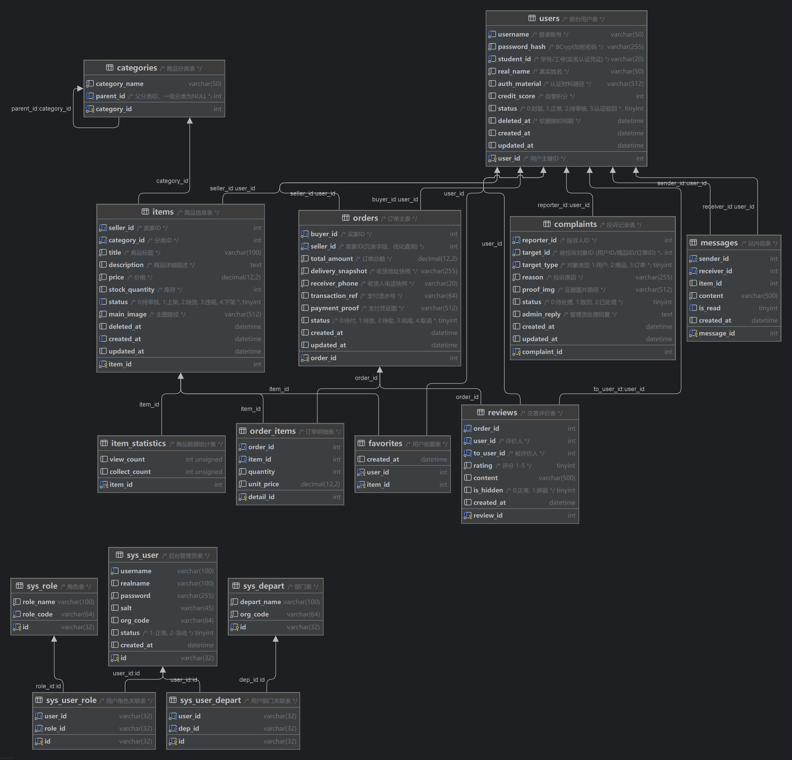

# 二手物品交易系统需求分析与数据库设计实验报告

## 一、 实验环境

- **操作系统**：Windows 11
- **数据库管理系统**：MySQL 8.0.x
- **设计工具**：Powerdesigner、Datagrip

## 二、 需求分析

本系统旨在建立一个安全、便捷的高校校内二手物品交易平台，连接校内买家与卖家，核心功能如下：

1. **用户与认证模块**：
   - **前台用户**：必须绑定学号/工号进行实名认证；支持信誉积分体系，违规操作扣分；支持账号软删除（注销）。
   - **后台管理**：基于 RBAC 模型，支持多角色（如超级管理员、审核员）、多部门管理。
2. **商品管理模块**：
   - **分类体系**：支持多级商品分类（如：图书->考研资料）。
   - **商品生命周期**：发布（待审）-> 审核通过（上架）-> 交易/库存空（缺货/下架）-> 违规下架。
   - **数据统计**：独立记录商品的浏览量与收藏量，支持高并发更新。
3. **交易核心模块**：
   - **订单流程**：支持购物车多商品合并结算；系统自动**根据卖家拆分为子订单**（即一次支付可包含多个商家的订单）；下单时记录收货地址快照与价格快照；支持上传支付凭证。
   - **库存控制**：下单锁库存，取消订单自动回滚库存。
4. **互动与风控模块**：
   - **站内信**：买卖双方可针对具体商品发起私聊。
   - **评价投诉**：交易完成后互评；支持针对订单或商品的投诉举报。

## 三、 概念结构设计

本节对系统内所有数据对象进行详细建模，分为“前台业务域”与“后台管理域”。

### 1. 实体与属性分析

#### (1) 前台业务域实体

- **前台用户 (User)**：
  - **属性**：{<u>用户ID</u>, 用户名, 密码哈希, 学号, 真实姓名, 认证材料路径, 信誉积分, 账号状态, 软删除标记, 注册时间, 更新时间}
  - **说明**：通过软删除标记维护历史数据完整性；`学号`为唯一实名凭证。
- **商品分类 (Category)**：
  - **属性**：{<u>分类ID</u>, 分类名称, 父分类ID}
  - **说明**：具有自关联属性，支持无限层级树状结构。
- **商品 (Item)**：
  - **属性**：{<u>商品ID</u>, 卖家ID, 分类ID, 标题, 描述, 价格, 库存数量, 状态(待审/上架/缺货/违规/下架), 主图路径, 软删除标记, 发布时间, 更新时间}
- **订单 (Order)**：
  - **属性**：{<u>订单ID</u>, 买家ID, 卖家ID(冗余), 订单总额, 收货地址快照, 收货电话快照, 支付流水号, 支付凭证图, 订单状态(待付/待发/待收/完成/取消), 创建时间, 更新时间}
- **订单明细 (Order_Item)**：
  - **属性**：{<u>明细ID</u>, 订单ID, 商品ID, 购买数量, 成交单价快照}
  - **说明**：记录下单时刻的瞬时价格，防止后续商品改价影响历史账单。
- **收藏记录 (Favorite)**：
  - **属性**：{<u>用户ID</u>, <u>商品ID</u>, 收藏时间}
  - **说明**：作为关联实体，连接用户与商品。
- **评价 (Review)**：
  - **属性**：{<u>评价ID</u>, 订单ID, 评价人ID, 被评价人ID, 评分(1-5), 评价内容, 是否屏蔽, 评价时间}
- **投诉 (Complaint)**：
  - **属性**：{<u>投诉ID</u>, 投诉人ID, 目标对象ID, 投诉原因, 证据图片, 处理状态, 管理员回复, 创建时间, 处理时间}
- **站内信 (Message)**：
  - **属性**：{<u>消息ID</u>, 发送者ID, 接收者ID, 关联商品ID, 消息内容, 阅读状态, 发送时间}
- **商品统计 (Item_Statistic)**：
  - **属性**：{<u>商品ID</u>, 浏览量, 收藏量}
  - **说明**：**垂直拆分实体**，将高频写入的计数器字段与低频修改的商品信息分离。

#### (2) 后台管理域实体 (RBAC模型)

- **系统管理员 (Sys_User)**：
  - **属性**：{<u>管理员ID</u>, 用户名, 真实姓名, 密码, 盐值, 组织机构编码, 状态, 创建时间}
- **部门 (Sys_Depart)**：
  - **属性**：{<u>部门ID</u>, 部门名称, 组织机构编码}
- **角色 (Sys_Role)**：
  - **属性**：{<u>角色ID</u>, 角色名称, 角色编码}
- **用户-角色关联 (Sys_User_Role)**：
  - **属性**：{<u>关联ID</u>, 管理员ID, 角色ID}
- **用户-部门关联 (Sys_User_Depart)**：
  - **属性**：{<u>关联ID</u>, 管理员ID, 部门ID}

### 2. E-R 图与关键联系分析

E-R 图如下


#### (1) 核心业务关系

1. **发布关系 (User - Item)**：**1:N**
   - 一个用户（卖家）可以发布多个商品；一个商品只能属于一个卖家。
2. **分类归属 (Category - Item)**：**1:N**
   - 一个分类下包含多个商品；一个商品只能属于一个叶子分类。
3. **分类层级 (Category - Category)**：**1:N (自关联)**
   - 一个父分类可以包含多个子分类；一个子分类只能属于一个父分类。
4. **收藏关系 (User - Item)**：**M:N**
   - 一个用户可以收藏多个商品；一个商品可以被多个用户收藏。（通过 `Favorites` 实体实现）。
5. **买家下单 (User - Order)**：**1:N**
   - 一个用户（买家）可以发起多个订单；一个订单只属于一个买家。
6. **卖家接单 (User - Order)**：**1:N**
   - 一个用户（卖家）可以接收多个订单；一个订单只属于一个卖家。
7. **订单构成 (Order - Item)**：**M:N**
   - 一个订单可以包含多个商品；一个商品可以出现在多个订单中（作为不同库存单位）。此关系由 `Order_Items` 实体作为连接表实现。
8. **交易评价 (Order - Review)**：**1:N**
   - 一个订单可以产生买卖双方的互评（最多2条）；一条评价仅针对一个订单。
9. **投诉发起 (User - Complaint)**：**1:N**
   - 一个用户可以发起多条投诉。
10. **站内沟通 (User - User)**：**M:N**
    - 用户之间互发消息，通过 `Messages` 实体记录，且可关联特定商品。

#### (2) 后台权限关系

1. **用户-角色 (Sys_User - Sys_Role)**：**M:N**
   - 一个管理员可拥有多个角色；一个角色可赋予多个管理员。（通过 `Sys_User_Role` 关联）。
2. **用户-部门 (Sys_User - Sys_Depart)**：**M:N**
   - 一个管理员可属于多个部门（兼职场景）；一个部门包含多个管理员。（通过 `Sys_User_Depart` 关联）。

## 四、 逻辑结构设计

### 1. 关系模式转换

将 E-R 图转换为关系模式，数据库表关系图如下：



标记主键（<u>下划线</u>）和外键（*斜体*）：

#### (1) 前台业务模块

- **Users** (<u>user_id</u>, username, password_hash, student_id, real_name, auth_material, credit_score, status, deleted_at, created_at, updated_at)
- **Categories** (<u>category_id</u>, category_name, *parent_id*)
- **Items** (<u>item_id</u>, *seller_id*, *category_id*, title, description, price, stock_quantity, status, main_image, deleted_at, created_at, updated_at)
- **Favorites** (<u>*user_id*</u>, <u>*item_id*</u>, created_at)
- **Orders** (<u>order_id</u>, *buyer_id*, *seller_id*, total_amount, delivery_snapshot, receiver_phone, transaction_ref, payment_proof, status, created_at, updated_at)
- **Order_Items** (<u>detail_id</u>, *order_id*, *item_id*, quantity, unit_price)
- **Reviews** (<u>review_id</u>, *order_id*, *user_id*, *to_user_id*, rating, content, is_hidden, created_at)
- **Complaints** (<u>complaint_id</u>, *reporter_id*, target_id, reason, proof_img, status, admin_reply, created_at, updated_at)
- **Messages** (<u>message_id</u>, *sender_id*, *receiver_id*, *item_id*, content, is_read, created_at)
- **Item_Statistics** (<u>*item_id*</u>, view_count, collect_count) —— *垂直分表，主键同时也是外键*

#### (2) 后台管理模块

- **Sys_User** (<u>id</u>, username, realname, password, salt, org_code, status, created_at)
- **Sys_Depart** (<u>id</u>, depart_name, org_code)
- **Sys_Role** (<u>id</u>, role_name, role_code)
- **Sys_User_Depart** (<u>id</u>, *user_id*, *dep_id*)
- **Sys_User_Role** (<u>id</u>, *user_id*, *role_id*)

### 2. 规范化分析

1. **3NF 检验**：
   - 所有表的主键明确，非主属性完全依赖于主键（满足 2NF）。
   - **Orders** 表中存储了 `delivery_snapshot`（地址快照），虽然 Users 表也有地址，但订单地址是历史状态，不随用户当前地址变化，属于对“订单”的直接依赖，消除了传递依赖，符合 3NF。
   - **Item_Statistics** 独立成表，将高频更新字段（计数器）与低频更新字段（商品描述）分离，虽然是一对一关系，但极大地优化了并发性能和锁竞争。
2. **约束完整性**：
   - 引入了 Check 约束（如 `price >= 0`）确保域完整性。
   - 定义了级联删除规则（如删除用户级联删除收藏，但保留订单），确保引用完整性。

## 五、 物理结构设计

### 1.**存储配置与环境**

- 数据库版本：MySQL 8.0
- 字符集：utf8mb4
- 排序规则：utf8mb4_0900_ai_ci

### 2. 表结构设计

#### (1) 前台业务域

```sql
-- 1. 用户表 (Users)
CREATE TABLE `Users` (
  `user_id` INT NOT NULL AUTO_INCREMENT COMMENT '用户主键ID',
  `username` VARCHAR(50) NOT NULL COMMENT '登录账号',
  `password_hash` VARCHAR(255) NOT NULL COMMENT 'BCrypt加密密码',
  `student_id` VARCHAR(20) NOT NULL COMMENT '学号/工号',
  `real_name` VARCHAR(50) NOT NULL COMMENT '真实姓名',
  `auth_material` VARCHAR(512) DEFAULT NULL COMMENT '认证材料路径',
  `credit_score` INT DEFAULT 100 COMMENT '信誉积分',
  `status` TINYINT DEFAULT 2 COMMENT '0:封禁, 1:正常, 2:待审核, 3:认证驳回',
  `deleted_at` DATETIME DEFAULT NULL COMMENT '软删除时间戳',
  `created_at` DATETIME DEFAULT CURRENT_TIMESTAMP,
  `updated_at` DATETIME DEFAULT CURRENT_TIMESTAMP ON UPDATE CURRENT_TIMESTAMP,
  PRIMARY KEY (`user_id`),
  CONSTRAINT `chk_user_credit` CHECK (`credit_score` >= 0),
  UNIQUE KEY `uk_student_id` (`student_id`),
  -- 软删除唯一索引：允许删除的用户重名，但活跃用户必须唯一
  UNIQUE KEY `uk_active_username` (`username`, (IF(`deleted_at` IS NULL, 1, NULL)))
) ENGINE=InnoDB COMMENT='前台用户表';

-- 2. 商品分类表 (Categories)
CREATE TABLE `Categories` (
  `category_id` INT NOT NULL AUTO_INCREMENT,
  `category_name` VARCHAR(50) NOT NULL,
  `parent_id` INT DEFAULT NULL,
  PRIMARY KEY (`category_id`),
  KEY `idx_parent_id` (`parent_id`),
  CONSTRAINT `fk_category_parent` FOREIGN KEY (`parent_id`) REFERENCES `Categories` (`category_id`) ON DELETE SET NULL
) ENGINE=InnoDB COMMENT='商品分类表';

-- 3. 商品表 (Items)
CREATE TABLE `Items` (
  `item_id` INT NOT NULL AUTO_INCREMENT,
  `seller_id` INT NOT NULL,
  `category_id` INT NOT NULL,
  `title` VARCHAR(100) NOT NULL,
  `description` TEXT COMMENT '商品详细描述',
  `price` DECIMAL(12, 2) NOT NULL,
  `stock_quantity` INT DEFAULT 1,
  `status` TINYINT DEFAULT 0 COMMENT '0:待审核, 1:上架, 2:缺货, 3:违规, 4:下架',
  `main_image` VARCHAR(512) NOT NULL,
  `deleted_at` DATETIME DEFAULT NULL,
  `created_at` DATETIME DEFAULT CURRENT_TIMESTAMP,
  `updated_at` DATETIME DEFAULT CURRENT_TIMESTAMP ON UPDATE CURRENT_TIMESTAMP,
  PRIMARY KEY (`item_id`),
  KEY `idx_seller_id` (`seller_id`),
  KEY `idx_category_id` (`category_id`),
  KEY `idx_item_status_date` (`status`, `created_at`),
  CONSTRAINT `chk_item_price` CHECK (`price` >= 0),
  CONSTRAINT `chk_item_stock` CHECK (`stock_quantity` >= 0),
  CONSTRAINT `fk_items_seller` FOREIGN KEY (`seller_id`) REFERENCES `Users` (`user_id`) ON DELETE RESTRICT,
  CONSTRAINT `fk_items_category` FOREIGN KEY (`category_id`) REFERENCES `Categories` (`category_id`) ON DELETE RESTRICT
) ENGINE=InnoDB COMMENT='商品信息表';

-- 4. 收藏表 (Favorites)
CREATE TABLE `Favorites` (
  `user_id` INT NOT NULL,
  `item_id` INT NOT NULL,
  `created_at` DATETIME DEFAULT CURRENT_TIMESTAMP,
  PRIMARY KEY (`user_id`, `item_id`),
  KEY `idx_fav_item` (`item_id`),
  CONSTRAINT `fk_fav_user` FOREIGN KEY (`user_id`) REFERENCES `Users` (`user_id`) ON DELETE CASCADE,
  CONSTRAINT `fk_fav_item` FOREIGN KEY (`item_id`) REFERENCES `Items` (`item_id`) ON DELETE CASCADE
) ENGINE=InnoDB COMMENT='用户收藏表';

-- 5. 订单表 (Orders)
CREATE TABLE `Orders` (
  `order_id` INT NOT NULL AUTO_INCREMENT,
  `buyer_id` INT NOT NULL,
  `seller_id` INT NOT NULL COMMENT '冗余卖家ID优化查询',
  `total_amount` DECIMAL(12, 2) NOT NULL,
  `delivery_snapshot` VARCHAR(255) NOT NULL,
  `receiver_phone` VARCHAR(20) NOT NULL,
  `transaction_ref` VARCHAR(64) DEFAULT NULL,
  `payment_proof` VARCHAR(512) DEFAULT NULL,
  `status` TINYINT DEFAULT 0 COMMENT '0:待付, 1:待发, 2:待收, 3:完成, 4:取消',
  `created_at` DATETIME DEFAULT CURRENT_TIMESTAMP,
  `updated_at` DATETIME DEFAULT CURRENT_TIMESTAMP ON UPDATE CURRENT_TIMESTAMP,
  PRIMARY KEY (`order_id`),
  KEY `idx_buyer_orders` (`buyer_id`),
  KEY `idx_seller_orders` (`seller_id`),
  CONSTRAINT `fk_order_buyer` FOREIGN KEY (`buyer_id`) REFERENCES `Users` (`user_id`) ON DELETE RESTRICT,
  CONSTRAINT `fk_order_seller` FOREIGN KEY (`seller_id`) REFERENCES `Users` (`user_id`) ON DELETE RESTRICT
) ENGINE=InnoDB COMMENT='订单主表';

-- 6. 订单明细表 (Order_Items)
CREATE TABLE `Order_Items` (
  `detail_id` INT NOT NULL AUTO_INCREMENT,
  `order_id` INT NOT NULL,
  `item_id` INT NOT NULL,
  `quantity` INT NOT NULL DEFAULT 1,
  `unit_price` DECIMAL(12, 2) NOT NULL,
  PRIMARY KEY (`detail_id`),
  UNIQUE KEY `uk_order_item` (`order_id`, `item_id`),
  CONSTRAINT `fk_detail_order` FOREIGN KEY (`order_id`) REFERENCES `Orders` (`order_id`) ON DELETE CASCADE,
  CONSTRAINT `fk_detail_item` FOREIGN KEY (`item_id`) REFERENCES `Items` (`item_id`) ON DELETE RESTRICT
) ENGINE=InnoDB COMMENT='订单明细表';

-- 7. 评价表 (Reviews)
CREATE TABLE `Reviews` (
  `review_id` INT NOT NULL AUTO_INCREMENT,
  `order_id` INT NOT NULL,
  `user_id` INT NOT NULL COMMENT '评价人',
  `to_user_id` INT NOT NULL COMMENT '被评价人',
  `rating` TINYINT NOT NULL,
  `content` VARCHAR(500) DEFAULT NULL,
  `is_hidden` TINYINT DEFAULT 0,
  `created_at` DATETIME DEFAULT CURRENT_TIMESTAMP,
  PRIMARY KEY (`review_id`),
  UNIQUE KEY `uk_order_review` (`order_id`, `user_id`),
  CONSTRAINT `chk_rating_range` CHECK (`rating` BETWEEN 1 AND 5),
  CONSTRAINT `fk_review_order` FOREIGN KEY (`order_id`) REFERENCES `Orders` (`order_id`) ON DELETE CASCADE,
  CONSTRAINT `fk_review_from` FOREIGN KEY (`user_id`) REFERENCES `Users` (`user_id`) ON DELETE CASCADE,
  CONSTRAINT `fk_review_to` FOREIGN KEY (`to_user_id`) REFERENCES `Users` (`user_id`) ON DELETE CASCADE
) ENGINE=InnoDB COMMENT='交易评价表';

-- 8. 投诉表 (Complaints)
CREATE TABLE `Complaints` (
  `complaint_id` INT NOT NULL AUTO_INCREMENT,
  `reporter_id` INT NOT NULL,
  `target_id` INT NOT NULL,
  `reason` VARCHAR(255) NOT NULL,
  `proof_img` VARCHAR(512) DEFAULT NULL,
  `status` TINYINT DEFAULT 0,
  `admin_reply` TEXT,
  `created_at` DATETIME DEFAULT CURRENT_TIMESTAMP,
  `updated_at` DATETIME DEFAULT NULL,
  PRIMARY KEY (`complaint_id`),
  CONSTRAINT `fk_complaint_reporter` FOREIGN KEY (`reporter_id`) REFERENCES `Users` (`user_id`) ON DELETE CASCADE
) ENGINE=InnoDB COMMENT='投诉记录表';

-- 9. 站内信表 (Messages)
CREATE TABLE `Messages` (
  `message_id` INT NOT NULL AUTO_INCREMENT,
  `sender_id` INT NOT NULL,
  `receiver_id` INT NOT NULL,
  `item_id` INT DEFAULT NULL,
  `content` VARCHAR(500) NOT NULL,
  `is_read` TINYINT DEFAULT 0,
  `created_at` DATETIME DEFAULT CURRENT_TIMESTAMP,
  PRIMARY KEY (`message_id`),
  KEY `idx_msg_chat` (`sender_id`, `receiver_id`),
  CONSTRAINT `fk_msg_sender` FOREIGN KEY (`sender_id`) REFERENCES `Users` (`user_id`) ON DELETE CASCADE,
  CONSTRAINT `fk_msg_receiver` FOREIGN KEY (`receiver_id`) REFERENCES `Users` (`user_id`) ON DELETE CASCADE
) ENGINE=InnoDB COMMENT='站内信表';

-- 10. 商品统计表 (Item_Statistics)
CREATE TABLE `Item_Statistics` (
  `item_id` INT NOT NULL,
  `view_count` INT UNSIGNED DEFAULT 0,
  `collect_count` INT UNSIGNED DEFAULT 0,
  PRIMARY KEY (`item_id`),
  CONSTRAINT `fk_stat_item` FOREIGN KEY (`item_id`) REFERENCES `Items` (`item_id`) ON DELETE CASCADE
) ENGINE=InnoDB COMMENT='商品数据统计表';
```

#### (2) 后台管理域

```sql
-- 11. 系统用户表 (sys_user)
CREATE TABLE `sys_user` (
  `id` VARCHAR(32) NOT NULL,
  `username` VARCHAR(100) NOT NULL,
  `realname` VARCHAR(100) DEFAULT NULL,
  `password` VARCHAR(255) NOT NULL,
  `salt` VARCHAR(45) DEFAULT NULL,
  `org_code` VARCHAR(64) DEFAULT NULL,
  `status` TINYINT DEFAULT 1,
  `created_at` DATETIME DEFAULT CURRENT_TIMESTAMP,
  PRIMARY KEY (`id`),
  UNIQUE KEY `uk_sys_username` (`username`)
) ENGINE=InnoDB COMMENT='后台管理员表';

-- 12. 部门表 (sys_depart)
CREATE TABLE `sys_depart` (
  `id` VARCHAR(32) NOT NULL,
  `depart_name` VARCHAR(100) NOT NULL,
  `org_code` VARCHAR(64) NOT NULL,
  PRIMARY KEY (`id`)
) ENGINE=InnoDB COMMENT='部门表';

-- 13. 角色表 (sys_role)
CREATE TABLE `sys_role` (
  `id` VARCHAR(32) NOT NULL,
  `role_name` VARCHAR(100) NOT NULL,
  `role_code` VARCHAR(64) NOT NULL,
  PRIMARY KEY (`id`),
  UNIQUE KEY `uk_role_code` (`role_code`)
) ENGINE=InnoDB COMMENT='角色表';

-- 14. 用户-角色关联表 (sys_user_role)
CREATE TABLE `sys_user_role` (
  `id` VARCHAR(32) NOT NULL,
  `user_id` VARCHAR(32) NOT NULL,
  `role_id` VARCHAR(32) NOT NULL,
  PRIMARY KEY (`id`),
  UNIQUE KEY `uk_user_role` (`user_id`, `role_id`),
  CONSTRAINT `fk_sur_user` FOREIGN KEY (`user_id`) REFERENCES `sys_user` (`id`) ON DELETE CASCADE,
  CONSTRAINT `fk_sur_role` FOREIGN KEY (`role_id`) REFERENCES `sys_role` (`id`) ON DELETE CASCADE
) ENGINE=InnoDB COMMENT='用户角色关联表';

-- 15. 用户-部门关联表 (sys_user_depart)
CREATE TABLE `sys_user_depart` (
  `id` VARCHAR(32) NOT NULL,
  `user_id` VARCHAR(32) NOT NULL,
  `dep_id` VARCHAR(32) NOT NULL,
  PRIMARY KEY (`id`),
  KEY `idx_sud_user` (`user_id`),
  CONSTRAINT `fk_sud_user` FOREIGN KEY (`user_id`) REFERENCES `sys_user` (`id`) ON DELETE CASCADE,
  CONSTRAINT `fk_sud_dep` FOREIGN KEY (`dep_id`) REFERENCES `sys_depart` (`id`) ON DELETE CASCADE
) ENGINE=InnoDB COMMENT='用户部门关联表';
```

### 3. 索引设计

为了应对高并发查询场景，除了主键（Primary Key）和唯一约束（Unique Key）自动生成的索引外，本系统特别针对核心业务路径建立了以下辅助索引，以确保关键查询能够命中索引（Index Hit），避免全表扫描。

| **索引名称**                 | **所属表**  | **索引列 (顺序敏感)**               | **设计意图与优化场景**                                       |
| ---------------------------- | ----------- | ----------------------------------- | ------------------------------------------------------------ |
| **idx_item_cat_status_time** | Items       | `(category_id, status, created_at)` | **覆盖索引**。优化商品广场的筛选查询：先按分类过滤，再选上架状态，最后按发布时间倒序展示。 |
| **idx_item_audit_queue**     | Items       | `(status, created_at)`              | **工作队列优化**。优化后台管理员获取“待审核”商品的查询速度，确保审核工作流的高效运转。 |
| **idx_item_id**              | Order_Items | `(item_id)`                         | **外键性能优化**。解决 `Order_Items` 表因联合主键最左前缀限制导致无法高效查询“某商品被谁购买”的问题，加速卖家端的销售统计。 |
| **idx_receiver_read**        | Messages    | `(receiver_id, is_read)`            | **高频读取优化**。优化站内信“收件箱”查询。将 `receiver_id` 放在首位以命中“查看我的消息”，包含 `is_read` 可加速未读消息数的统计。 |
| **idx_status_created**       | Orders      | `(status, created_at)`              | **定时任务优化**。加速“超时未支付订单自动取消”的定时任务查询 (`status=0 AND time < NOW-30min`)，防止随订单量增长导致的扫描卡顿。 |

### 4. 过程化对象实施

#### 视图设计

**`v_market_items` (商品广场视图)** 该视图构建了“商品广场”所需的数据宽表。它连接了 `Items`（商品基本信息）、`Users`（卖家用户名）和 `Item_Statistics`（统计数据）三张表。通过预定义过滤条件（只显示已上架、有库存且未删除的商品），前端开发人员可以直接查询此视图而无需每次编写复杂的 JOIN 语句，降低了开发复杂度并统一了数据出口。

**`v_platform_stats` (平台数据大屏视图)** 这是一个聚合视图，用于后台首页的仪表盘展示。它汇总了全平台的关键指标（活跃用户数、在线商品数、成交订单数、总交易额GMV）。虽然包含了多个子查询，但在数据量可控的情况下，能快速提供宏观运营数据，避免了在应用层进行多次独立的统计查询。

```sql
-- 1. 商品广场视图 
CREATE OR REPLACE VIEW v_market_items AS
SELECT
    i.item_id,
    i.seller_id,  -- 必须加上这一行！
    i.title, i.price, i.stock_quantity, i.main_image, i.created_at,
    u.username AS seller_name,
    IFNULL(ist.view_count, 0) AS view_count,
    IFNULL(ist.collect_count, 0) AS collect_count
FROM Items i
JOIN Users u ON i.seller_id = u.user_id
LEFT JOIN Item_Statistics ist ON i.item_id = ist.item_id
WHERE i.status = 1 AND i.stock_quantity > 0 AND i.deleted_at IS NULL;

-- 2. 平台数据统计视图
CREATE OR REPLACE VIEW v_platform_stats AS
SELECT 
    (SELECT COUNT(*) FROM Users WHERE status = 1) AS total_active_users,
    (SELECT COUNT(*) FROM Items WHERE status = 1) AS active_items,
    (SELECT COUNT(*) FROM Orders WHERE status = 3) AS completed_orders,
    (SELECT IFNULL(SUM(total_amount), 0) FROM Orders WHERE status = 3) AS total_gmv;
```

#### 存储过程设计

（1） **`sp_create_order` (订单创建存储过程)**

 该存储过程封装了复杂的下单业务逻辑，确保在高并发环境下的数据一致性。

1. **输入**：接收买家ID、卖家ID、商品JSON列表（包含ID和数量）、地址和电话快照。
2. **核心逻辑**：
   - **事务控制**：整个过程包裹在数据库事务中，确保原子性。
   - **JSON解析与排序**：使用 `JSON_TABLE` 解析前端传来的商品列表，并按 `item_id` 升序排序，这对于防止死锁至关重要。
   - **库存校验与锁行**：使用 `FOR UPDATE` 对商品记录加排他锁，防止超卖。同时校验卖家是否一致（防止跨店下单逻辑错误）以及商品状态（必须为上架状态）。
   - **订单生成**：校验通过后，先插入 `Orders` 主表。
   - **扣减库存**：再次遍历商品列表，插入 `Order_Items` 明细表，并扣减对应商品的库存。若库存归零，自动将商品状态更新为“缺货”。
3. **输出**：返回执行结果代码（200成功，400库存不足等）及新生成的订单ID。

```sql
DELIMITER //

DROP PROCEDURE IF EXISTS sp_create_order //

CREATE PROCEDURE sp_create_order(
    IN p_buyer_id INT,
    IN p_seller_id INT,
    IN p_items_json JSON, 
    IN p_addr_snapshot VARCHAR(255),
    IN p_phone_snapshot VARCHAR(20),
    OUT p_res_code INT, 
    OUT p_order_id INT
)
BEGIN
    DECLARE v_total DECIMAL(12,2) DEFAULT 0;
    DECLARE v_itm_id INT;
    DECLARE v_qty INT;
    DECLARE v_price DECIMAL(12,2);
    DECLARE v_stock INT;
    DECLARE v_status TINYINT;
    DECLARE v_real_seller_id INT;
    DECLARE done INT DEFAULT FALSE;
    
    DECLARE cur_items CURSOR FOR 
        SELECT item_id, qty 
        FROM JSON_TABLE(p_items_json, "$[*]" COLUMNS(item_id INT PATH "$.item_id", qty INT PATH "$.qty")) AS jt
        ORDER BY item_id ASC;
        
    DECLARE CONTINUE HANDLER FOR NOT FOUND SET done = TRUE;
    DECLARE EXIT HANDLER FOR SQLEXCEPTION BEGIN ROLLBACK; SET p_res_code=500; END;

    START TRANSACTION;

    OPEN cur_items;
    check_loop: LOOP
        FETCH cur_items INTO v_itm_id, v_qty;
        IF done THEN LEAVE check_loop; END IF;
        
        SET v_real_seller_id = NULL;

        SELECT price, stock_quantity, status, seller_id 
        INTO v_price, v_stock, v_status, v_real_seller_id
        FROM Items WHERE item_id = v_itm_id FOR UPDATE; 
        
        IF v_real_seller_id IS NULL THEN ROLLBACK; SET p_res_code = 404; CLOSE cur_items; LEAVE check_loop; END IF;
        IF v_real_seller_id != p_seller_id THEN ROLLBACK; SET p_res_code = 403; CLOSE cur_items; LEAVE check_loop; END IF;
        IF v_status != 1 THEN ROLLBACK; SET p_res_code = 402; CLOSE cur_items; LEAVE check_loop; 
        ELSEIF v_stock < v_qty THEN ROLLBACK; SET p_res_code = 400; CLOSE cur_items; LEAVE check_loop; END IF;
        
        SET v_total = v_total + (v_price * v_qty);
    END LOOP;
    CLOSE cur_items;

    IF p_res_code IS NULL THEN
        INSERT INTO Orders (buyer_id, seller_id, total_amount, status, delivery_snapshot, receiver_phone) 
        VALUES (p_buyer_id, p_seller_id, v_total, 0, p_addr_snapshot, p_phone_snapshot);
        SET p_order_id = LAST_INSERT_ID();

        SET @i = 0;
        WHILE @i < JSON_LENGTH(p_items_json) DO
            SET v_itm_id = JSON_UNQUOTE(JSON_EXTRACT(p_items_json, CONCAT('$[', @i, '].item_id')));
            SET v_qty = JSON_UNQUOTE(JSON_EXTRACT(p_items_json, CONCAT('$[', @i, '].qty')));
            SELECT price INTO v_price FROM Items WHERE item_id = v_itm_id;
            
            INSERT INTO Order_Items (order_id, item_id, quantity, unit_price) 
            VALUES (p_order_id, v_itm_id, v_qty, v_price);
            
            UPDATE Items 
            SET stock_quantity = stock_quantity - v_qty,
                status = IF(stock_quantity = 0, 2, status)
            WHERE item_id = v_itm_id;
            
            SET @i = @i + 1;
        END WHILE;
        COMMIT; SET p_res_code = 200;
    END IF;
END //
DELIMITER ;
```

 **(2) 浏览量更新过程**`sp_inc_view_count`
 考虑到浏览量更新极其高频，直接数据库写入压力过大。应用层使用 Redis 缓存计数，每积累一定阈值（如10次）或定时（如每分钟）调用一次数据库更新接口。

```sql
DELIMITER //
-- 批量回写浏览量 (由定时任务或Redis写回调用)
CREATE PROCEDURE sp_inc_view_count(IN p_item_id INT, IN p_inc_val INT)
BEGIN
    -- 使用 ON DUPLICATE KEY UPDATE 确保统计行存在
    INSERT INTO Item_Statistics (item_id, view_count) VALUES (p_item_id, p_inc_val)
    ON DUPLICATE KEY UPDATE view_count = view_count + p_inc_val;
END;
//
DELIMITER ;
```

####  触发器与任务调度

**说明：** **`trg_fav_add` (收藏同步触发器)** 该触发器负责维护 `Item_Statistics` 统计表中的收藏计数。当 `Favorites` 表有新记录插入（即用户点击收藏）时，触发器会自动执行。

```sql
DELIMITER //
-- 1. 收藏数据实时同步触发器
-- 当用户收藏时，自动增加统计表中的计数
CREATE TRIGGER trg_fav_add
AFTER INSERT ON Favorites
FOR EACH ROW
BEGIN
    -- 使用 ON DUPLICATE KEY UPDATE 防止统计表行不存在
    INSERT INTO Item_Statistics (item_id, collect_count) VALUES (NEW.item_id, 1)
    ON DUPLICATE KEY UPDATE collect_count = collect_count + 1;
END;
//

```

**说明：** **`trg_fav_del` (取消收藏同步触发器)** 该触发器与 `trg_fav_add` 对应。当 `Favorites` 表中的记录被删除（即用户取消收藏）时，它会自动减少 `Item_Statistics` 表中对应商品的收藏计数。这避免了应用层需要编写额外的代码来维护统计数据，降低了代码耦合度。

```sql
-- 2. 取消收藏同步触发器
--  GREATEST 防御性编程，防止因数据不一致导致的无符号整数溢出错误
CREATE TRIGGER trg_fav_del
AFTER DELETE ON Favorites
FOR EACH ROW
BEGIN
    UPDATE Item_Statistics 
    SET collect_count = GREATEST(CAST(collect_count AS SIGNED) - 1, 0) 
    WHERE item_id = OLD.item_id;
END;
//
```

**说明：** **`trg_restore_stock` (库存智能回滚触发器)** 该触发器用于处理订单取消后的善后工作。当 `Orders` 表中的订单状态更新为“取消”（状态码4）时触发。

1. **库存恢复**：它会查询该订单关联的所有商品明细，将对应的购买数量加回 `Items` 表的库存中。
2. **状态智能恢复**：这是该触发器的核心亮点。它会判断商品当前的状态——如果商品之前是因为卖光了而变成“缺货”（状态码2），那么在库存恢复后，它会自动将商品重新设为“上架”（状态码1）。但如果商品是因为“违规”或“卖家主动下架”而处于非销售状态，触发器则不会错误地将其重新上架，确保了业务逻辑的严密性。

```sql
-- 3. 智能库存回滚触发器
-- 订单取消时，恢复库存，并智能恢复上架状态
CREATE TRIGGER trg_restore_stock
AFTER UPDATE ON Orders
FOR EACH ROW
BEGIN
    IF NEW.status = 4 AND OLD.status != 4 THEN
        UPDATE Items i
        JOIN Order_Items oi ON i.item_id = oi.item_id
        SET 
            i.stock_quantity = i.stock_quantity + oi.quantity,
            -- 仅恢复因自动售罄(status=2)而下架的商品
            -- 若商品是卖家主动违规下架(3)或手动下架(4)，即使库存恢复，也不应自动上架，需人工干预。
            i.status = IF(i.status = 2, 1, i.status)
        WHERE oi.order_id = NEW.order_id;
    END IF;
END;
//
DELIMITER ;
```

#### 数据库安全配置 (Security Configuration)

为了遵循**最小权限原则 (Principle of Least Privilege)**，系统实施了严格的访问控制策略。应用程序不使用 `root` 超级管理员账户连接数据库，而是通过专用的应用账户 `market_app` 进行连接。该账户仅被授予执行业务逻辑所需的 DML（数据操作）和 Execute（执行存储过程）权限，严禁授予 DDL（数据定义）权限，以从根源上防止 SQL 注入攻击导致的删表或结构篡改风险。

**安全实施脚本：**

```sql
-- 1. 创建应用专用连接账户
CREATE USER IF NOT EXISTS 'market_app'@'%' IDENTIFIED BY 'Market_Pwd_2025!';

-- 2. 授予基础增删改查权限 (DML)
-- 允许应用对所有表进行数据操作，支撑正常的业务流转
GRANT SELECT, INSERT, UPDATE, DELETE ON UniversitySecondHandDB.* TO 'market_app'@'%';

-- 3. 授予存储过程执行权限
-- 允许应用调用 sp_create_order 等核心业务过程
GRANT EXECUTE ON UniversitySecondHandDB.* TO 'market_app'@'%';

-- 4. 刷新权限使设置立即生效
FLUSH PRIVILEGES;
```
