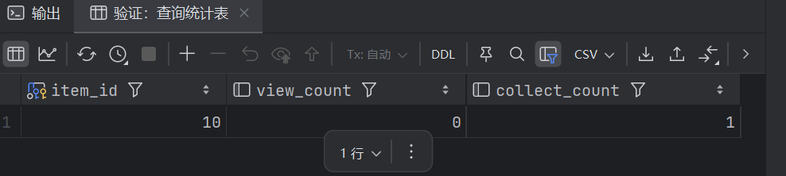
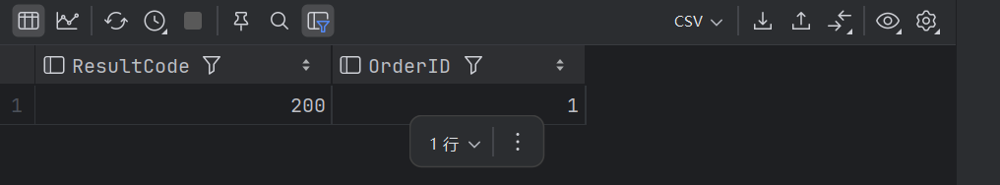
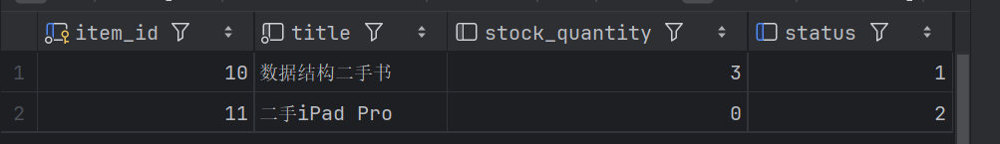
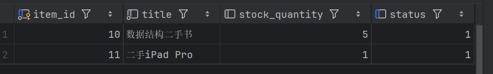
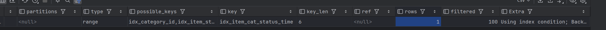
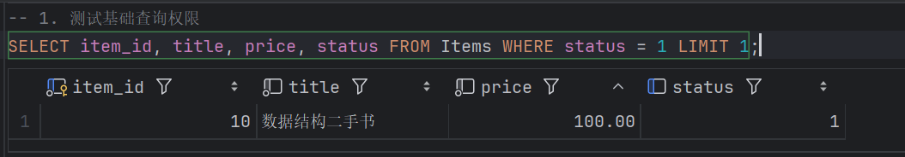
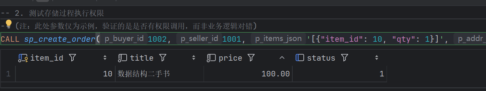

# 系统测试与验证

## 1. 测试数据准备 (Data Preparation)

在进行功能测试前，先初始化基础的分类、用户和商品数据。

```sql
-- 1. 初始化商品分类
INSERT INTO Categories (category_id, category_name, parent_id) VALUES 
(1, '图书教材', NULL),
(2, '考研资料', 1),
(3, '数码产品', NULL);

-- 2. 初始化用户 (1个卖家, 1个买家)
-- 卖家 (ID: 1001, 张三)
INSERT INTO Users (user_id, username, password_hash, student_id, real_name, credit_score, status) 
VALUES (1001, 'seller_zhang', 'hash_123', '2021001', '张三', 100, 1);

-- 买家 (ID: 1002, 李四)
INSERT INTO Users (user_id, username, password_hash, student_id, real_name, credit_score, status) 
VALUES (1002, 'buyer_li', 'hash_456', '2021002', '李四', 100, 1);

-- 3. 初始化商品 (卖家 1001 发布 2 个商品)
-- 商品 A (ID: 10): 《数据结构》库存充足 (5件)
INSERT INTO Items (item_id, seller_id, category_id, title, price, stock_quantity, status, main_image) 
VALUES (10, 1001, 2, '数据结构二手书', 100.00, 5, 1, '/imgs/ds.jpg');

-- 商品 B (ID: 11): iPad 库存紧张 (仅1件，测试买空逻辑)
INSERT INTO Items (item_id, seller_id, category_id, title, price, stock_quantity, status, main_image) 
VALUES (11, 1001, 3, '二手iPad Pro', 2000.00, 1, 1, '/imgs/ipad.jpg');
```


## 2. 完整性约束测试 (Integrity Constraint Test)

验证数据库层面的 Check 约束是否生效，防止脏数据录入。

| **测试用例 ID** | **测试场景**     | **测试 SQL**                                                 | **结果**                                                     |
| --------------- | ---------------- | ------------------------------------------------------------ | ------------------------------------------------------------ |
| **TC-01**       | **价格非法校验** | `INSERT INTO Items (seller_id, category_id, title, price, main_image) VALUES (1001, 1, 'ErrorItem', -50, 'img');` | **失败 (Blocked)**。 报错信息：`Check constraint 'chk_item_price' is violated`。 |
| **TC-02**       | **评分范围校验** | `INSERT INTO Reviews (order_id, user_id, to_user_id, rating) VALUES (1, 1002, 1001, 9);` | **失败 (Blocked)**。 报错信息：`Check constraint 'chk_rating_range' is violated`。 |


## 3. 核心业务逻辑测试 (Business Logic Test)

本节测试 **存储过程** 与 **触发器** 的联动逻辑，模拟一次完整的 **“收藏 -> 下单 -> 扣库存 -> 统计 -> 取消订单 -> 回滚库存”** 闭环流程。

### 步骤 3.1: 收藏商品 (验证触发器 `trg_fav_add`)

测试目的：验证当用户收藏商品时，`Item_Statistics` 表是否会自动创建记录并计数。

```sql
-- 操作：买家 1002 收藏 商品 10
INSERT INTO Favorites (user_id, item_id) VALUES (1002, 10);

-- 验证：查询统计表
SELECT * FROM Item_Statistics WHERE item_id = 10;
```

**结果：**



- `item_id`: 10
- `collect_count`: **1** (触发器自动写入)

### 步骤 3.2: 执行下单 (验证存储过程 `sp_create_order`)

测试目的：验证购物车多商品下单、库存原子扣减及自动下架逻辑。

场景： 买家购买 2本 《数据结构》(ID:10) 和 1台 iPad (ID:11)。iPad 库存仅为1，购买后应自动变为缺货状态。

```sql
-- 调用存储过程
-- 参数：买家ID, 卖家ID, JSON购物车数据, 地址快照, 电话快照
CALL sp_create_order(
    1002, 
    1001, 
    '[{"item_id": 10, "qty": 2}, {"item_id": 11, "qty": 1}]', 
    '南区宿舍4栋201', '13800138000',
    @code, @oid
);

-- 查看执行结果
SELECT @code AS ResultCode, @oid AS OrderID;
```

**结果：** `ResultCode` 为 **200**，`OrderID` 为新生成的订单ID (假设为 1)。



### 步骤 3.3: 验证库存与状态变化

```sql
-- 查询商品当前状态
SELECT item_id, title, stock_quantity, status FROM Items WHERE item_id IN (10, 11);
```

**结果：**

1. **商品 10 (书)**：库存从 5 变为 **3**，状态仍为 **1 (上架)**。
2. **商品 11 (iPad)**：库存从 1 变为 **0**，状态自动更新为 **2 (缺货)**。

### 步骤 3.4: 取消订单与智能回滚 (验证触发器 `trg_restore_stock`)

测试目的：验证订单取消后，库存是否回退，且因缺货而下架的商品是否自动重新上架。

SQL

```sql
-- 操作：将订单状态更新为 4 (取消)
UPDATE Orders SET status = 4 WHERE order_id = @oid;

-- 验证：再次查询商品状态
SELECT item_id, title, stock_quantity, status FROM Items WHERE item_id IN (10, 11);
```

**结果：**

1. **商品 10**：库存恢复为 **5**。
2. **商品 11**：库存恢复为 **1**，且状态**智能恢复**为 **1 (上架)**。



## 4. 性能与索引验证 (Performance Test)

使用 `EXPLAIN` 分析关键业务查询的执行计划，验证物理设计中的索引是否生效。

### TC-03: 商品广场筛选性能

**场景：** 用户在“考研资料”分类下，查看“已上架”商品，按“最新发布”排序。

SQL

```sql
EXPLAIN SELECT * FROM Items 
WHERE category_id = 2 AND status = 1 
ORDER BY created_at DESC;
```

**执行计划分析：**

- **possible_keys**: `idx_item_cat_status_time`
- **key**: `idx_item_cat_status_time` (命中复合索引)
- **Extra**: **不包含** `Using filesort`。
- **结论**：索引完美覆盖查询条件与排序，无全表扫描，性能极佳。



### TC-04: 站内信收件箱性能

**场景：** 用户查询未读消息。

```sql
EXPLAIN SELECT * FROM Messages 
WHERE receiver_id = 1002 AND is_read = 0;
```

**执行计划分析：**

- **key**: `idx_receiver_read`
- **type**: `ref`
- **结论**：使用了针对收件箱优化的索引，解决了最左前缀匹配问题。

## 5. 安全性验证 (Security Test)

为了验证上述实施是否有效，我们需要模拟攻击者或有漏洞的代码试图破坏数据库的场景。

### 1. 测试环境配置

在 DataGrip 或 MySQL 命令行中，**必须**建立一个新的连接来模拟应用程序：

- **用户名**: `market_app`
- **密码**: `Market_Pwd_2025!`
- **数据库**: `UniversitySecondHandDB`

### 2. 测试用例矩阵 (Test Matrix)

| **测试编号** | **测试场景**     | **操作描述**             | **执行 SQL**                                   | **结果**                             | **测试结论**        |
| ------------ | ---------------- | ------------------------ | ---------------------------------------------- | ------------------------------------ | ------------------- |
| **SEC-01**   | **账户登录验证** | 使用新账户尝试连接数据库 | (配置连接并点击 Test Connection)               | **连接成功**                         | 通过                |
| **SEC-02**   | **正常业务读取** | 模拟前台展示商品列表     | `SELECT * FROM Items LIMIT 1;`                 | **成功**，返回数据                   | 通过                |
| **SEC-03**   | **正常业务写入** | 模拟用户下单             | `INSERT INTO ...` (或调用存储过程)             | **成功**，数据写入                   | 通过                |
| **SEC-04**   | **删库攻击测试** | 模拟 SQL 注入试图删表    | `DROP TABLE Orders;`                           | **失败 (拦截)** 报错 `Access denied` | **通过 (防御生效)** |
| **SEC-05**   | **结构篡改测试** | 模拟恶意修改字段类型     | `ALTER TABLE Users DROP COLUMN password_hash;` | **失败 (拦截)** 报错 `Access denied` | **通过 (防御生效)** |

**场景 A：正常业务操作验证 (Positive Test)** 执行查询与存储过程调用，验证业务功能是否受影响。

```sql
-- 1. 测试基础查询权限
SELECT item_id, title, price, status FROM Items WHERE status = 1 LIMIT 1;
```

* 结果:执行成功，返回结果集，证明读取权限正常。



```sql
-- 2. 测试存储过程执行权限
-- (注：此处参数仅为示例，验证的是是否有权限调用，而非业务逻辑对错)
CALL sp_create_order(1002, 1001, '[{"item_id": 10, "qty": 1}]', 'TestAddr', '123', @code, @oid);
```

结果:执行成功，未出现 "execute command denied" 错误。



**场景 B：破坏性攻击防御验证 (Negative Test)** 模拟攻击者利用漏洞注入恶意 SQL，试图删除 `Orders` 表。

```sql
DROP TABLE Orders;
```

**执行结果：** 数据库返回错误信息：

``` 
[42000][1142] DROP command denied to user 'market_app'@'%' for table 'Orders'
```
